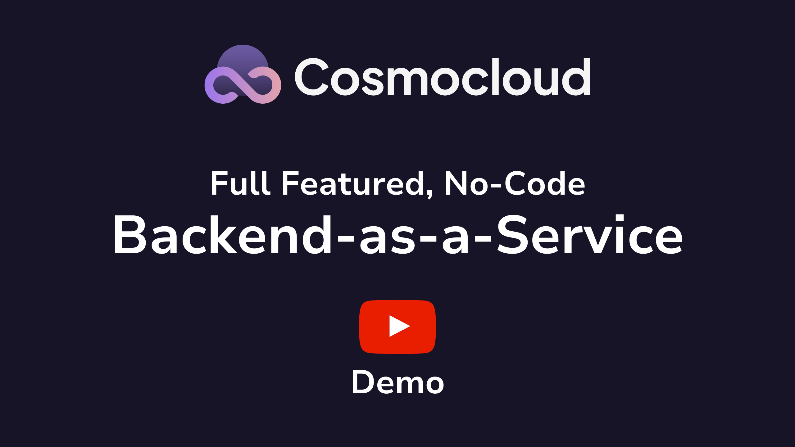

# Cosmocloud Documentation

## Introduction

!!! info "Info"

    Cosmocloud is in access only beta mode right now. Please reach out on <contact@cosmocloud.io> to request faster access.

[Cosmocloud](https://cosmocloud.io) is the only full featured, no-code, Backend-as-a-Service platform which aim to simplify the application development with building complex APIs, easy database management, one-click deployments, and authentication.

A fully production battle-ready, secure and performant platform which aims not to just build your MVP and POC apps but to run your backend layer with Billions of API calls every month! Cosmocloud uses proven tech stacks to build your backend layer, with no compromise to scalability, customisability and security!

{:target="_blank"}

Without the hassle of spending long dev hours writing code, maintaining huge teams to manage infrastructure and deployments, Cosmocloud abstracts everything from code to deployments to infrastructure in a single Black-box.

!!! tip "Info"

    Make your developers at least **10x more productive**!
